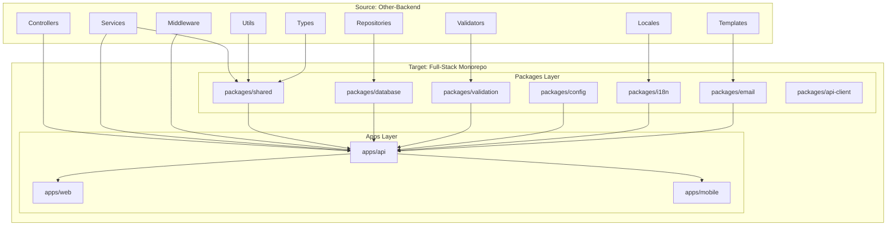
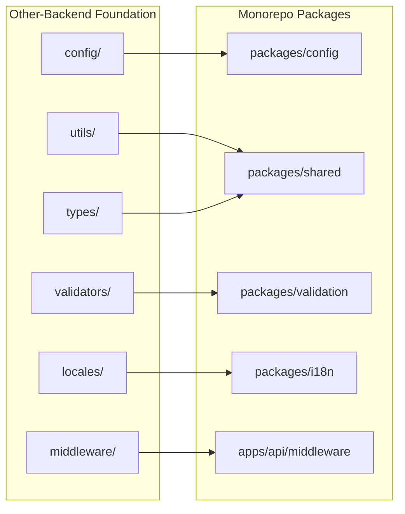
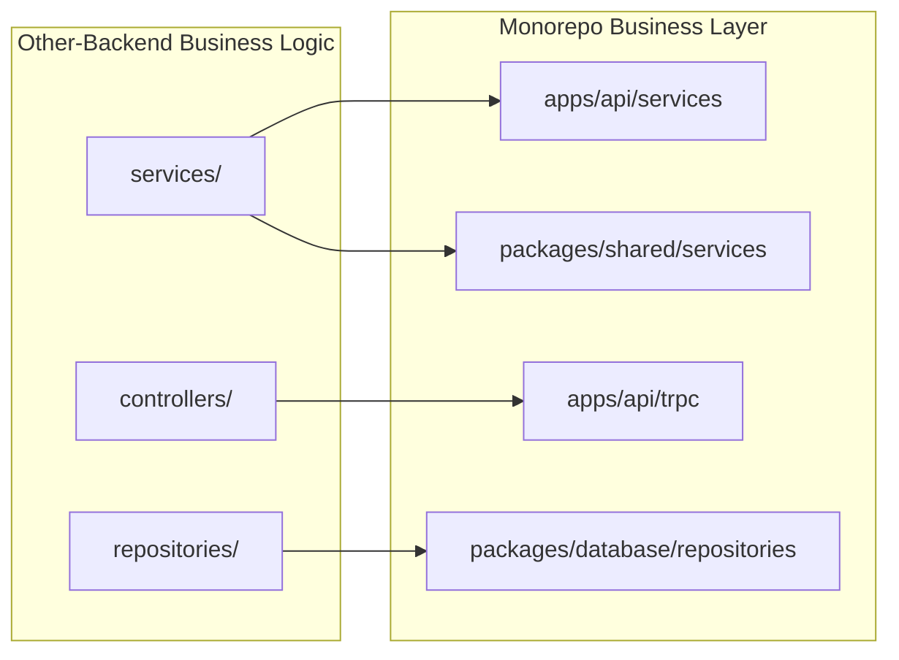

# Backend Migration Integration - Design Document

## Overview

This design document outlines the comprehensive architecture and implementation strategy for migrating and integrating all functionality from the standalone e-commerce backend (other-backend) into our existing full-stack monorepo. The design ensures zero functionality loss while leveraging our modern monorepo architecture with tRPC, Drizzle ORM, and shared packages.

The migration will transform a traditional Express.js/Prisma backend into a modern, type-safe, full-stack system while preserving all business logic, advanced features, and enterprise-level capabilities. The design emphasizes systematic integration at the highest architectural level, ensuring all components work seamlessly within our monorepo ecosystem.

## Architecture

### Migration Architecture Overview



### Detailed Migration Mapping

#### 1. Foundation Layer Migration



#### 2. Business Logic Migration



## Components and Interfaces

### 1. Database Layer Integration

#### Schema Migration Strategy

```typescript
// Migration from Prisma to Drizzle
// packages/database/src/schema/migrated-entities.ts

// Example: Loyalty Program Schema
export const loyaltyPrograms = pgTable('loyalty_programs', {
  id: uuid('id').primaryKey().defaultRandom(),
  name: varchar('name', { length: 255 }).notNull(),
  description: text('description'),
  pointsPerDollar: decimal('points_per_dollar', { precision: 10, scale: 2 }).notNull(),
  isActive: boolean('is_active').default(true),
  createdAt: timestamp('created_at', { withTimezone: true }).defaultNow(),
  updatedAt: timestamp('updated_at', { withTimezone: true }).defaultNow(),
});

export const loyaltyTiers = pgTable('loyalty_tiers', {
  id: uuid('id').primaryKey().defaultRandom(),
  programId: uuid('program_id').notNull().references(() => loyaltyPrograms.id),
  name: varchar('name', { length: 255 }).notNull(),
  minPoints: integer('min_points').notNull(),
  maxPoints: integer('max_points'),
  benefits: jsonb('benefits'),
  multiplier: decimal('multiplier', { precision: 5, scale: 2 }).default('1.00'),
  createdAt: timestamp('created_at', { withTimezone: true }).defaultNow(),
});

export const userLoyaltyPoints = pgTable('user_loyalty_points', {
  id: uuid('id').primaryKey().defaultRandom(),
  userId: uuid('user_id').notNull().references(() => users.id),
  programId: uuid('program_id').notNull().references(() => loyaltyPrograms.id),
  points: integer('points').default(0),
  tierId: uuid('tier_id').references(() => loyaltyTiers.id),
  lifetimePoints: integer('lifetime_points').default(0),
  createdAt: timestamp('created_at', { withTimezone: true }).defaultNow(),
  updatedAt: timestamp('updated_at', { withTimezone: true }).defaultNow(),
});

// A/B Testing Schema
export const abTests = pgTable('ab_tests', {
  id: uuid('id').primaryKey().defaultRandom(),
  name: varchar('name', { length: 255 }).notNull(),
  description: text('description'),
  status: varchar('status', { length: 50 }).notNull().default('draft'),
  startDate: timestamp('start_date', { withTimezone: true }),
  endDate: timestamp('end_date', { withTimezone: true }),
  trafficAllocation: decimal('traffic_allocation', { precision: 5, scale: 2 }).default('100.00'),
  variants: jsonb('variants').notNull(),
  metrics: jsonb('metrics'),
  createdAt: timestamp('created_at', { withTimezone: true }).defaultNow(),
  updatedAt: timestamp('updated_at', { withTimezone: true }).defaultNow(),
});

export const abTestAssignments = pgTable('ab_test_assignments', {
  id: uuid('id').primaryKey().defaultRandom(),
  testId: uuid('test_id').notNull().references(() => abTests.id),
  userId: uuid('user_id').references(() => users.id),
  sessionId: varchar('session_id', { length: 255 }),
  variant: varchar('variant', { length: 100 }).notNull(),
  assignedAt: timestamp('assigned_at', { withTimezone: true }).defaultNow(),
});

// Vendor Analytics Schema
export const vendorAnalytics = pgTable('vendor_analytics', {
  id: uuid('id').primaryKey().defaultRandom(),
  vendorId: uuid('vendor_id').notNull().references(() => vendors.id),
  date: date('date').notNull(),
  totalSales: decimal('total_sales', { precision: 15, scale: 2 }).default('0.00'),
  totalOrders: integer('total_orders').default(0),
  totalItems: integer('total_items').default(0),
  averageOrderValue: decimal('average_order_value', { precision: 10, scale: 2 }).default('0.00'),
  conversionRate: decimal('conversion_rate', { precision: 5, scale: 4 }).default('0.0000'),
  createdAt: timestamp('created_at', { withTimezone: true }).defaultNow(),
});
```

#### Repository Pattern Integration

```typescript
// packages/database/src/repositories/base-repository.ts
export abstract class BaseRepository<T, CreateInput, UpdateInput> {
  constructor(
    protected db: DatabaseConnection,
    protected table: any,
    protected schema: any
  ) {}

  async findById(id: string): Promise<T | null> {
    const result = await this.db.select().from(this.table).where(eq(this.table.id, id));
    return result[0] || null;
  }

  async findMany(params: FindManyParams = {}): Promise<PaginatedResponse<T>> {
    const { where, include, select, orderBy, page = 1, limit = 20 } = params;
    
    let query = this.db.select(select || {}).from(this.table);
    
    if (where) {
      query = query.where(this.buildWhereClause(where));
    }
    
    if (orderBy) {
      query = query.orderBy(orderBy);
    }
    
    const offset = (page - 1) * limit;
    const results = await query.limit(limit).offset(offset);
    
    const totalQuery = this.db.select({ count: count() }).from(this.table);
    if (where) {
      totalQuery.where(this.buildWhereClause(where));
    }
    const [{ count: total }] = await totalQuery;
    
    return {
      data: results,
      pagination: {
        page,
        limit,
        total,
        totalPages: Math.ceil(total / limit),
      },
    };
  }

  async create(data: CreateInput): Promise<T> {
    const [result] = await this.db.insert(this.table).values(data).returning();
    return result;
  }

  async update(id: string, data: UpdateInput): Promise<T> {
    const [result] = await this.db
      .update(this.table)
      .set({ ...data, updatedAt: new Date() })
      .where(eq(this.table.id, id))
      .returning();
    return result;
  }

  async delete(id: string): Promise<void> {
    await this.db.delete(this.table).where(eq(this.table.id, id));
  }

  async softDelete(id: string): Promise<T> {
    const [result] = await this.db
      .update(this.table)
      .set({ deletedAt: new Date(), updatedAt: new Date() })
      .where(eq(this.table.id, id))
      .returning();
    return result;
  }

  protected buildWhereClause(where: any): any {
    // Implementation for building complex where clauses
    // This will be customized based on the specific needs
    return where;
  }
}

// packages/database/src/repositories/loyalty-repository.ts
export class LoyaltyRepository extends BaseRepository<
  LoyaltyProgram,
  CreateLoyaltyProgramInput,
  UpdateLoyaltyProgramInput
> {
  constructor(db: DatabaseConnection) {
    super(db, loyaltyPrograms, loyaltyProgramSchema);
  }

  async getUserPoints(userId: string, programId: string): Promise<UserLoyaltyPoints | null> {
    const result = await this.db
      .select()
      .from(userLoyaltyPoints)
      .where(
        and(
          eq(userLoyaltyPoints.userId, userId),
          eq(userLoyaltyPoints.programId, programId)
        )
      );
    return result[0] || null;
  }

  async addPoints(userId: string, programId: string, points: number): Promise<UserLoyaltyPoints> {
    return await this.db.transaction(async (tx) => {
      const existing = await this.getUserPoints(userId, programId);
      
      if (existing) {
        const [updated] = await tx
          .update(userLoyaltyPoints)
          .set({
            points: existing.points + points,
            lifetimePoints: existing.lifetimePoints + points,
            updatedAt: new Date(),
          })
          .where(eq(userLoyaltyPoints.id, existing.id))
          .returning();
        return updated;
      } else {
        const [created] = await tx
          .insert(userLoyaltyPoints)
          .values({
            userId,
            programId,
            points,
            lifetimePoints: points,
          })
          .returning();
        return created;
      }
    });
  }

  async getLeaderboard(programId: string, limit: number = 10): Promise<LeaderboardEntry[]> {
    return await this.db
      .select({
        userId: userLoyaltyPoints.userId,
        points: userLoyaltyPoints.points,
        lifetimePoints: userLoyaltyPoints.lifetimePoints,
        user: {
          firstName: users.firstName,
          lastName: users.lastName,
          email: users.email,
        },
      })
      .from(userLoyaltyPoints)
      .leftJoin(users, eq(userLoyaltyPoints.userId, users.id))
      .where(eq(userLoyaltyPoints.programId, programId))
      .orderBy(desc(userLoyaltyPoints.points))
      .limit(limit);
  }
}
```

### 2. Service Layer Integration

#### Business Logic Migration

```typescript
// apps/api/src/services/loyalty.service.ts
export class LoyaltyService {
  constructor(
    private loyaltyRepository: LoyaltyRepository,
    private userRepository: UserRepository,
    private orderRepository: OrderRepository,
    private eventPublisher: EventPublisher,
    private cacheService: CacheService,
    private emailService: EmailService
  ) {}

  async createProgram(data: CreateLoyaltyProgramInput): Promise<LoyaltyProgram> {
    // Validate business rules
    await this.validateProgramRules(data);
    
    const program = await this.loyaltyRepository.create(data);
    
    // Publish event for analytics
    await this.eventPublisher.publish('loyalty.program.created', {
      programId: program.id,
      name: program.name,
    });
    
    // Clear cache
    await this.cacheService.invalidate('loyalty:programs');
    
    return program;
  }

  async awardPoints(
    userId: string,
    programId: string,
    points: number,
    reason: string,
    orderId?: string
  ): Promise<PointsTransaction> {
    return await this.loyaltyRepository.transaction(async (tx) => {
      // Award points
      const userPoints = await this.loyaltyRepository.addPoints(userId, programId, points);
      
      // Create transaction record
      const transaction = await this.pointsTransactionRepository.create({
        userId,
        programId,
        points,
        type: 'earned',
        reason,
        orderId,
      });
      
      // Check for tier upgrades
      await this.checkTierUpgrade(userId, programId, userPoints.lifetimePoints);
      
      // Send notification
      await this.sendPointsNotification(userId, points, reason);
      
      return transaction;
    });
  }

  async redeemPoints(
    userId: string,
    programId: string,
    points: number,
    rewardId: string
  ): Promise<RedemptionResult> {
    const userPoints = await this.loyaltyRepository.getUserPoints(userId, programId);
    
    if (!userPoints || userPoints.points < points) {
      throw new InsufficientPointsError('Not enough points for redemption');
    }
    
    const reward = await this.rewardRepository.findById(rewardId);
    if (!reward || !reward.isActive) {
      throw new InvalidRewardError('Reward not available');
    }
    
    return await this.loyaltyRepository.transaction(async (tx) => {
      // Deduct points
      await this.loyaltyRepository.addPoints(userId, programId, -points);
      
      // Create redemption record
      const redemption = await this.redemptionRepository.create({
        userId,
        programId,
        rewardId,
        pointsUsed: points,
        status: 'pending',
      });
      
      // Process reward fulfillment
      await this.processRewardFulfillment(redemption);
      
      return {
        redemption,
        remainingPoints: userPoints.points - points,
      };
    });
  }

  private async checkTierUpgrade(
    userId: string,
    programId: string,
    lifetimePoints: number
  ): Promise<void> {
    const currentTier = await this.getTierByPoints(programId, lifetimePoints);
    const userPoints = await this.loyaltyRepository.getUserPoints(userId, programId);
    
    if (currentTier && (!userPoints.tierId || currentTier.id !== userPoints.tierId)) {
      await this.loyaltyRepository.updateUserTier(userId, programId, currentTier.id);
      
      // Send tier upgrade notification
      await this.emailService.sendTierUpgradeEmail(userId, currentTier);
      
      // Publish event
      await this.eventPublisher.publish('loyalty.tier.upgraded', {
        userId,
        programId,
        newTierId: currentTier.id,
        lifetimePoints,
      });
    }
  }
}

// apps/api/src/services/analytics.service.ts
export class AnalyticsService {
  constructor(
    private orderRepository: OrderRepository,
    private productRepository: ProductRepository,
    private userRepository: UserRepository,
    private cacheService: CacheService
  ) {}

  async getDashboardAnalytics(
    startDate: Date,
    endDate: Date,
    previousStartDate?: Date,
    previousEndDate?: Date
  ): Promise<DashboardAnalytics> {
    const cacheKey = `analytics:dashboard:${startDate.toISOString()}:${endDate.toISOString()}`;
    
    return await this.cacheService.getOrSet(cacheKey, async () => {
      const [
        salesSummary,
        customerSummary,
        productSummary,
        orderSummary,
        recentOrders,
        topProducts,
        salesByCategory,
        salesByVendor,
        salesTrend,
      ] = await Promise.all([
        this.getSalesSummary(startDate, endDate, previousStartDate, previousEndDate),
        this.getCustomerSummary(startDate, endDate, previousStartDate, previousEndDate),
        this.getProductSummary(startDate, endDate),
        this.getOrderSummary(startDate, endDate),
        this.getRecentOrders(10),
        this.getTopProducts(10, startDate, endDate),
        this.getSalesByCategory(startDate, endDate),
        this.getSalesByVendor(startDate, endDate),
        this.getSalesTrend(startDate, endDate, 'daily'),
      ]);

      return {
        salesSummary,
        customerSummary,
        productSummary,
        orderSummary,
        recentOrders,
        topProducts,
        salesByCategory,
        salesByVendor,
        salesTrend,
        period: { startDate, endDate },
      };
    }, 300); // Cache for 5 minutes
  }

  private async getSalesSummary(
    startDate: Date,
    endDate: Date,
    previousStartDate?: Date,
    previousEndDate?: Date
  ): Promise<SalesAnalytics> {
    // Complex aggregation query using Drizzle
    const currentPeriodQuery = this.orderRepository.db
      .select({
        totalSales: sum(orders.totalAmount),
        orderCount: count(orders.id),
        totalItems: sum(orderItems.quantity),
      })
      .from(orders)
      .leftJoin(orderItems, eq(orders.id, orderItems.orderId))
      .where(
        and(
          gte(orders.createdAt, startDate),
          lte(orders.createdAt, endDate),
          eq(orders.status, 'completed')
        )
      );

    const [currentPeriod] = await currentPeriodQuery;
    
    let previousPeriod = null;
    if (previousStartDate && previousEndDate) {
      const previousPeriodQuery = this.orderRepository.db
        .select({
          totalSales: sum(orders.totalAmount),
          orderCount: count(orders.id),
          totalItems: sum(orderItems.quantity),
        })
        .from(orders)
        .leftJoin(orderItems, eq(orders.id, orderItems.orderId))
        .where(
          and(
            gte(orders.createdAt, previousStartDate),
            lte(orders.createdAt, previousEndDate),
            eq(orders.status, 'completed')
          )
        );

      [previousPeriod] = await previousPeriodQuery;
    }

    const growth = this.calculateGrowth(currentPeriod, previousPeriod);

    return {
      currentPeriod: {
        totalSales: Number(currentPeriod.totalSales || 0),
        orderCount: currentPeriod.orderCount || 0,
        averageOrderValue: currentPeriod.orderCount 
          ? Number(currentPeriod.totalSales || 0) / currentPeriod.orderCount 
          : 0,
        totalItems: currentPeriod.totalItems || 0,
      },
      previousPeriod: previousPeriod ? {
        totalSales: Number(previousPeriod.totalSales || 0),
        orderCount: previousPeriod.orderCount || 0,
        averageOrderValue: previousPeriod.orderCount 
          ? Number(previousPeriod.totalSales || 0) / previousPeriod.orderCount 
          : 0,
        totalItems: previousPeriod.totalItems || 0,
      } : undefined,
      growth,
    };
  }

  private calculateGrowth(current: any, previous: any): GrowthMetrics {
    if (!previous) {
      return {
        totalSales: 0,
        orderCount: 0,
        averageOrderValue: 0,
        totalItems: 0,
      };
    }

    return {
      totalSales: this.calculatePercentageGrowth(
        Number(current.totalSales || 0),
        Number(previous.totalSales || 0)
      ),
      orderCount: this.calculatePercentageGrowth(
        current.orderCount || 0,
        previous.orderCount || 0
      ),
      averageOrderValue: this.calculatePercentageGrowth(
        current.orderCount ? Number(current.totalSales || 0) / current.orderCount : 0,
        previous.orderCount ? Number(previous.totalSales || 0) / previous.orderCount : 0
      ),
      totalItems: this.calculatePercentageGrowth(
        current.totalItems || 0,
        previous.totalItems || 0
      ),
    };
  }
}
```

### 3. tRPC Router Integration

#### Type-Safe API Layer

```typescript
// apps/api/src/trpc/routers/loyalty.ts
export const loyaltyRouter = router({
  // Program Management
  createProgram: adminProcedure
    .input(CreateLoyaltyProgramSchema)
    .mutation(async ({ input, ctx }) => {
      return await ctx.loyaltyService.createProgram(input);
    }),

  getPrograms: publicProcedure
    .input(z.object({
      page: z.number().default(1),
      limit: z.number().default(20),
      isActive: z.boolean().optional(),
    }))
    .query(async ({ input, ctx }) => {
      return await ctx.loyaltyService.getPrograms(input);
    }),

  // Points Management
  getUserPoints: protectedProcedure
    .input(z.object({
      programId: z.string().uuid(),
    }))
    .query(async ({ input, ctx }) => {
      return await ctx.loyaltyService.getUserPoints(ctx.user.id, input.programId);
    }),

  awardPoints: adminProcedure
    .input(z.object({
      userId: z.string().uuid(),
      programId: z.string().uuid(),
      points: z.number().positive(),
      reason: z.string(),
      orderId: z.string().uuid().optional(),
    }))
    .mutation(async ({ input, ctx }) => {
      return await ctx.loyaltyService.awardPoints(
        input.userId,
        input.programId,
        input.points,
        input.reason,
        input.orderId
      );
    }),

  redeemPoints: protectedProcedure
    .input(z.object({
      programId: z.string().uuid(),
      rewardId: z.string().uuid(),
      points: z.number().positive(),
    }))
    .mutation(async ({ input, ctx }) => {
      return await ctx.loyaltyService.redeemPoints(
        ctx.user.id,
        input.programId,
        input.points,
        input.rewardId
      );
    }),

  // Analytics
  getPointsHistory: protectedProcedure
    .input(z.object({
      programId: z.string().uuid(),
      page: z.number().default(1),
      limit: z.number().default(20),
      startDate: z.date().optional(),
      endDate: z.date().optional(),
    }))
    .query(async ({ input, ctx }) => {
      return await ctx.loyaltyService.getPointsHistory(ctx.user.id, input);
    }),

  getLeaderboard: publicProcedure
    .input(z.object({
      programId: z.string().uuid(),
      limit: z.number().default(10),
    }))
    .query(async ({ input, ctx }) => {
      return await ctx.loyaltyService.getLeaderboard(input.programId, input.limit);
    }),
});

// apps/api/src/trpc/routers/analytics.ts
export const analyticsRouter = router({
  getDashboard: adminProcedure
    .input(z.object({
      startDate: z.date(),
      endDate: z.date(),
      compareWithPrevious: z.boolean().default(false),
    }))
    .query(async ({ input, ctx }) => {
      let previousStartDate, previousEndDate;
      
      if (input.compareWithPrevious) {
        const daysDiff = Math.ceil(
          (input.endDate.getTime() - input.startDate.getTime()) / (1000 * 60 * 60 * 24)
        );
        previousEndDate = new Date(input.startDate);
        previousStartDate = new Date(input.startDate.getTime() - daysDiff * 24 * 60 * 60 * 1000);
      }

      return await ctx.analyticsService.getDashboardAnalytics(
        input.startDate,
        input.endDate,
        previousStartDate,
        previousEndDate
      );
    }),

  getSalesTrend: adminProcedure
    .input(z.object({
      startDate: z.date(),
      endDate: z.date(),
      interval: z.enum(['hourly', 'daily', 'weekly', 'monthly']).default('daily'),
    }))
    .query(async ({ input, ctx }) => {
      return await ctx.analyticsService.getSalesTrend(
        input.startDate,
        input.endDate,
        input.interval
      );
    }),

  getTopProducts: adminProcedure
    .input(z.object({
      limit: z.number().default(10),
      startDate: z.date(),
      endDate: z.date(),
      categoryId: z.string().uuid().optional(),
    }))
    .query(async ({ input, ctx }) => {
      return await ctx.analyticsService.getTopProducts(
        input.limit,
        input.startDate,
        input.endDate,
        input.categoryId
      );
    }),

  exportAnalytics: adminProcedure
    .input(z.object({
      type: z.enum(['sales', 'products', 'customers', 'orders']),
      format: z.enum(['csv', 'excel', 'pdf']),
      startDate: z.date(),
      endDate: z.date(),
      filters: z.record(z.any()).optional(),
    }))
    .mutation(async ({ input, ctx }) => {
      return await ctx.exportService.exportAnalytics(input);
    }),
});

// apps/api/src/trpc/routers/ab-test.ts
export const abTestRouter = router({
  createTest: adminProcedure
    .input(CreateABTestSchema)
    .mutation(async ({ input, ctx }) => {
      return await ctx.abTestService.createTest(input);
    }),

  getTests: adminProcedure
    .input(z.object({
      page: z.number().default(1),
      limit: z.number().default(20),
      status: z.enum(['draft', 'running', 'paused', 'completed']).optional(),
    }))
    .query(async ({ input, ctx }) => {
      return await ctx.abTestService.getTests(input);
    }),

  getAssignment: publicProcedure
    .input(z.object({
      testId: z.string().uuid(),
      userId: z.string().uuid().optional(),
      sessionId: z.string().optional(),
    }))
    .query(async ({ input, ctx }) => {
      return await ctx.abTestService.getAssignment(
        input.testId,
        input.userId || ctx.user?.id,
        input.sessionId
      );
    }),

  recordConversion: publicProcedure
    .input(z.object({
      testId: z.string().uuid(),
      userId: z.string().uuid().optional(),
      sessionId: z.string().optional(),
      metric: z.string(),
      value: z.number().optional(),
    }))
    .mutation(async ({ input, ctx }) => {
      return await ctx.abTestService.recordConversion(
        input.testId,
        input.userId || ctx.user?.id,
        input.sessionId,
        input.metric,
        input.value
      );
    }),

  getResults: adminProcedure
    .input(z.object({
      testId: z.string().uuid(),
    }))
    .query(async ({ input, ctx }) => {
      return await ctx.abTestService.getResults(input.testId);
    }),
});
```

### 4. Frontend Integration Architecture

#### Web Application Components

```typescript
// apps/web/src/app/dashboard/analytics/page.tsx
'use client';

import { useState } from 'react';
import { api } from '@/lib/trpc';
import { DateRangePicker } from '@/components/ui/date-range-picker';
import { AnalyticsDashboard } from '@/components/analytics/dashboard';
import { ExportButton } from '@/components/analytics/export-button';

export default function AnalyticsPage() {
  const [dateRange, setDateRange] = useState({
    startDate: new Date(Date.now() - 30 * 24 * 60 * 60 * 1000),
    endDate: new Date(),
  });
  const [compareWithPrevious, setCompareWithPrevious] = useState(false);

  const { data: analytics, isLoading, error } = api.analytics.getDashboard.useQuery({
    startDate: dateRange.startDate,
    endDate: dateRange.endDate,
    compareWithPrevious,
  });

  if (isLoading) return <AnalyticsLoadingSkeleton />;
  if (error) return <ErrorMessage error={error} />;

  return (
    <div className="space-y-6">
      <div className="flex justify-between items-center">
        <h1 className="text-3xl font-bold">Analytics Dashboard</h1>
        <div className="flex gap-4">
          <DateRangePicker
            value={dateRange}
            onChange={setDateRange}
          />
          <ExportButton
            onExport={(format) => handleExport(format, dateRange)}
          />
        </div>
      </div>

      <div className="flex items-center gap-2">
        <input
          type="checkbox"
          id="compare"
          checked={compareWithPrevious}
          onChange={(e) => setCompareWithPrevious(e.target.checked)}
        />
        <label htmlFor="compare">Compare with previous period</label>
      </div>

      {analytics && (
        <AnalyticsDashboard
          data={analytics}
          dateRange={dateRange}
          showComparison={compareWithPrevious}
        />
      )}
    </div>
  );
}

// apps/web/src/components/analytics/dashboard.tsx
interface AnalyticsDashboardProps {
  data: DashboardAnalytics;
  dateRange: { startDate: Date; endDate: Date };
  showComparison: boolean;
}

export function AnalyticsDashboard({ data, dateRange, showComparison }: AnalyticsDashboardProps) {
  return (
    <div className="grid grid-cols-1 lg:grid-cols-2 xl:grid-cols-4 gap-6">
      {/* Sales Summary Cards */}
      <MetricCard
        title="Total Sales"
        value={formatCurrency(data.salesSummary.currentPeriod.totalSales)}
        change={showComparison ? data.salesSummary.growth.totalSales : undefined}
        icon={<DollarSign className="h-4 w-4" />}
      />
      
      <MetricCard
        title="Orders"
        value={data.salesSummary.currentPeriod.orderCount.toLocaleString()}
        change={showComparison ? data.salesSummary.growth.orderCount : undefined}
        icon={<ShoppingCart className="h-4 w-4" />}
      />
      
      <MetricCard
        title="Average Order Value"
        value={formatCurrency(data.salesSummary.currentPeriod.averageOrderValue)}
        change={showComparison ? data.salesSummary.growth.averageOrderValue : undefined}
        icon={<TrendingUp className="h-4 w-4" />}
      />
      
      <MetricCard
        title="Items Sold"
        value={data.salesSummary.currentPeriod.totalItems.toLocaleString()}
        change={showComparison ? data.salesSummary.growth.totalItems : undefined}
        icon={<Package className="h-4 w-4" />}
      />

      {/* Charts */}
      <div className="col-span-full lg:col-span-2">
        <SalesTrendChart data={data.salesTrend} />
      </div>
      
      <div className="col-span-full lg:col-span-2">
        <TopProductsChart data={data.topProducts} />
      </div>
      
      <div className="col-span-full lg:col-span-1">
        <SalesByCategoryChart data={data.salesByCategory} />
      </div>
      
      <div className="col-span-full lg:col-span-1">
        <SalesByVendorChart data={data.salesByVendor} />
      </div>

      {/* Recent Orders Table */}
      <div className="col-span-full">
        <RecentOrdersTable orders={data.recentOrders} />
      </div>
    </div>
  );
}

// apps/web/src/app/loyalty/page.tsx
'use client';

export default function LoyaltyPage() {
  const { data: programs } = api.loyalty.getPrograms.useQuery({});
  const { data: userPoints } = api.loyalty.getUserPoints.useQuery({
    programId: programs?.[0]?.id || '',
  }, {
    enabled: !!programs?.[0]?.id,
  });

  return (
    <div className="space-y-6">
      <h1 className="text-3xl font-bold">Loyalty Program</h1>
      
      {userPoints && (
        <LoyaltyPointsCard
          points={userPoints.points}
          lifetimePoints={userPoints.lifetimePoints}
          tier={userPoints.tier}
        />
      )}
      
      <div className="grid grid-cols-1 lg:grid-cols-2 gap-6">
        <AvailableRewards programId={programs?.[0]?.id} />
        <PointsHistory programId={programs?.[0]?.id} />
      </div>
      
      <Leaderboard programId={programs?.[0]?.id} />
    </div>
  );
}
```

#### Mobile Application Integration

```typescript
// apps/mobile/src/screens/analytics/AnalyticsScreen.tsx
import React, { useState } from 'react';
import { View, ScrollView, RefreshControl } from 'react-native';
import { api } from '@/lib/trpc';
import { AnalyticsCard } from '@/components/analytics/AnalyticsCard';
import { SalesChart } from '@/components/charts/SalesChart';
import { DateRangePicker } from '@/components/ui/DateRangePicker';

export function AnalyticsScreen() {
  const [dateRange, setDateRange] = useState({
    startDate: new Date(Date.now() - 30 * 24 * 60 * 60 * 1000),
    endDate: new Date(),
  });
  const [refreshing, setRefreshing] = useState(false);

  const { data: analytics, isLoading, refetch } = api.analytics.getDashboard.useQuery({
    startDate: dateRange.startDate,
    endDate: dateRange.endDate,
    compareWithPrevious: false,
  });

  const onRefresh = async () => {
    setRefreshing(true);
    await refetch();
    setRefreshing(false);
  };

  return (
    <ScrollView
      refreshControl={
        <RefreshControl refreshing={refreshing} onRefresh={onRefresh} />
      }
      className="flex-1 bg-gray-50"
    >
      <View className="p-4 space-y-4">
        <DateRangePicker
          value={dateRange}
          onChange={setDateRange}
        />

        {analytics && (
          <>
            <View className="grid grid-cols-2 gap-4">
              <AnalyticsCard
                title="Total Sales"
                value={formatCurrency(analytics.salesSummary.currentPeriod.totalSales)}
                icon="dollar-sign"
              />
              <AnalyticsCard
                title="Orders"
                value={analytics.salesSummary.currentPeriod.orderCount.toString()}
                icon="shopping-cart"
              />
            </View>

            <SalesChart data={analytics.salesTrend} />

            <TopProductsList products={analytics.topProducts} />
          </>
        )}
      </View>
    </ScrollView>
  );
}

// apps/mobile/src/screens/loyalty/LoyaltyScreen.tsx
export function LoyaltyScreen() {
  const { data: programs } = api.loyalty.getPrograms.useQuery({});
  const { data: userPoints } = api.loyalty.getUserPoints.useQuery({
    programId: programs?.[0]?.id || '',
  }, {
    enabled: !!programs?.[0]?.id,
  });

  return (
    <ScrollView className="flex-1 bg-gray-50">
      <View className="p-4 space-y-4">
        {userPoints && (
          <LoyaltyPointsCard
            points={userPoints.points}
            lifetimePoints={userPoints.lifetimePoints}
            tier={userPoints.tier}
          />
        )}
        
        <AvailableRewardsList programId={programs?.[0]?.id} />
        <PointsHistoryList programId={programs?.[0]?.id} />
      </View>
    </ScrollView>
  );
}
```

### 5. Shared Package Integration

#### Internationalization Package

```typescript
// packages/i18n/src/index.ts
import i18next from 'i18next';
import { initReactI18next } from 'react-i18next';

// Import all translations from migrated locales
import enCommon from './locales/en/common.json';
import enEmails from './locales/en/emails.json';
import enErrors from './locales/en/errors.json';
import enValidation from './locales/en/validation.json';

import deCommon from './locales/de/common.json';
import deEmails from './locales/de/emails.json';
import deErrors from './locales/de/errors.json';
import deValidation from './locales/de/validation.json';

// ... other languages (ES, FR, ZH)

const resources = {
  en: {
    common: enCommon,
    emails: enEmails,
    errors: enErrors,
    validation: enValidation,
  },
  de: {
    common: deCommon,
    emails: deEmails,
    errors: deErrors,
    validation: deValidation,
  },
  // ... other languages
};

i18next
  .use(initReactI18next)
  .init({
    resources,
    lng: 'en',
    fallbackLng: 'en',
    interpolation: {
      escapeValue: false,
    },
    ns: ['common', 'emails', 'errors', 'validation'],
    defaultNS: 'common',
  });

export default i18next;
export { useTranslation } from 'react-i18next';
```

#### Email Package Integration

```typescript
// packages/email/src/service.ts
import nodemailer from 'nodemailer';
import handlebars from 'handlebars';
import { readFileSync } from 'fs';
import { join } from 'path';

export class EmailService {
  private transporter: nodemailer.Transporter;
  private templates: Map<string, handlebars.TemplateDelegate> = new Map();

  constructor(config: EmailConfig) {
    this.transporter = nodemailer.createTransporter(config.smtp);
    this.loadTemplates();
  }

  private loadTemplates() {
    const templateDir = join(__dirname, 'templates');
    const templates = [
      'welcome',
      'order-confirmation',
      'order-shipped',
      'order-delivered',
      'password-reset',
      'loyalty-tier-upgrade',
      'points-awarded',
    ];

    templates.forEach(templateName => {
      const templatePath = join(templateDir, `${templateName}.html`);
      const templateContent = readFileSync(templatePath, 'utf-8');
      this.templates.set(templateName, handlebars.compile(templateContent));
    });
  }

  async sendEmail(options: SendEmailOptions): Promise<void> {
    const { to, subject, template, data, language = 'en' } = options;
    
    const templateFn = this.templates.get(template);
    if (!templateFn) {
      throw new Error(`Template ${template} not found`);
    }

    // Add language-specific data
    const templateData = {
      ...data,
      language,
      // Add translated strings based on language
    };

    const html = templateFn(templateData);

    await this.transporter.sendMail({
      to,
      subject,
      html,
      from: process.env.EMAIL_FROM,
    });
  }

  async sendWelcomeEmail(user: User, language: string = 'en'): Promise<void> {
    await this.sendEmail({
      to: user.email,
      subject: 'Welcome to our platform!',
      template: 'welcome',
      data: {
        firstName: user.firstName,
        lastName: user.lastName,
      },
      language,
    });
  }

  async sendOrderConfirmation(order: Order, language: string = 'en'): Promise<void> {
    await this.sendEmail({
      to: order.user.email,
      subject: `Order Confirmation - ${order.orderNumber}`,
      template: 'order-confirmation',
      data: {
        orderNumber: order.orderNumber,
        items: order.items,
        totalAmount: order.totalAmount,
        shippingAddress: order.shippingAddress,
      },
      language,
    });
  }

  async sendLoyaltyTierUpgrade(user: User, tier: LoyaltyTier, language: string = 'en'): Promise<void> {
    await this.sendEmail({
      to: user.email,
      subject: `Congratulations! You've reached ${tier.name} tier`,
      template: 'loyalty-tier-upgrade',
      data: {
        firstName: user.firstName,
        tierName: tier.name,
        benefits: tier.benefits,
      },
      language,
    });
  }
}
```

## Data Models

### Comprehensive Type System

```typescript
// packages/shared/src/types/loyalty.ts
export interface LoyaltyProgram {
  id: string;
  name: string;
  description?: string;
  pointsPerDollar: number;
  isActive: boolean;
  tiers: LoyaltyTier[];
  rewards: LoyaltyReward[];
  createdAt: Date;
  updatedAt: Date;
}

export interface LoyaltyTier {
  id: string;
  programId: string;
  name: string;
  minPoints: number;
  maxPoints?: number;
  benefits: TierBenefit[];
  multiplier: number;
  createdAt: Date;
}

export interface UserLoyaltyPoints {
  id: string;
  userId: string;
  programId: string;
  points: number;
  lifetimePoints: number;
  tierId?: string;
  tier?: LoyaltyTier;
  createdAt: Date;
  updatedAt: Date;
}

export interface PointsTransaction {
  id: string;
  userId: string;
  programId: string;
  points: number;
  type: 'earned' | 'redeemed' | 'expired' | 'adjusted';
  reason: string;
  orderId?: string;
  redemptionId?: string;
  createdAt: Date;
}

// packages/shared/src/types/analytics.ts
export interface DashboardAnalytics {
  salesSummary: SalesAnalytics;
  customerSummary: CustomerSummary;
  productSummary: ProductSummary;
  orderSummary: OrderSummary;
  recentOrders: RecentOrderSummary[];
  topProducts: ProductSalesData[];
  salesByCategory: CategorySalesData[];
  salesByVendor: VendorSalesData[];
  salesTrend: SalesTrendData[];
  period: {
    startDate: Date;
    endDate: Date;
  };
}

export interface SalesAnalytics {
  currentPeriod: {
    totalSales: number;
    orderCount: number;
    averageOrderValue: number;
    totalItems: number;
  };
  previousPeriod?: {
    totalSales: number;
    orderCount: number;
    averageOrderValue: number;
    totalItems: number;
  };
  growth: {
    totalSales: number;
    orderCount: number;
    averageOrderValue: number;
    totalItems: number;
  };
}

// packages/shared/src/types/ab-test.ts
export interface ABTest {
  id: string;
  name: string;
  description?: string;
  status: 'draft' | 'running' | 'paused' | 'completed';
  startDate?: Date;
  endDate?: Date;
  trafficAllocation: number;
  variants: ABTestVariant[];
  metrics: ABTestMetric[];
  createdAt: Date;
  updatedAt: Date;
}

export interface ABTestVariant {
  id: string;
  name: string;
  description?: string;
  allocation: number;
  config: Record<string, any>;
}

export interface ABTestAssignment {
  id: string;
  testId: string;
  userId?: string;
  sessionId?: string;
  variant: string;
  assignedAt: Date;
}

export interface ABTestConversion {
  id: string;
  testId: string;
  userId?: string;
  sessionId?: string;
  variant: string;
  metric: string;
  value?: number;
  createdAt: Date;
}
```

## Error Handling

### Comprehensive Error Management System

```typescript
// packages/shared/src/errors/index.ts
export class AppError extends Error {
  constructor(
    public message: string,
    public statusCode: number = 500,
    public code: string = 'INTERNAL_ERROR',
    public details?: any
  ) {
    super(message);
    this.name = this.constructor.name;
  }
}

export class ValidationError extends AppError {
  constructor(message: string, details?: any) {
    super(message, 400, 'VALIDATION_ERROR', details);
  }
}

export class NotFoundError extends AppError {
  constructor(resource: string, id?: string) {
    super(
      `${resource}${id ? ` with id ${id}` : ''} not found`,
      404,
      'NOT_FOUND'
    );
  }
}

export class InsufficientPointsError extends AppError {
  constructor(message: string = 'Insufficient loyalty points') {
    super(message, 400, 'INSUFFICIENT_POINTS');
  }
}

export class InvalidRewardError extends AppError {
  constructor(message: string = 'Invalid or unavailable reward') {
    super(message, 400, 'INVALID_REWARD');
  }
}

export class ABTestError extends AppError {
  constructor(message: string) {
    super(message, 400, 'AB_TEST_ERROR');
  }
}

// apps/api/src/middleware/error-handler.ts
export const errorHandler = (error: any, req: any, res: any, next: any) => {
  if (error instanceof AppError) {
    return res.status(error.statusCode).json({
      success: false,
      error: {
        code: error.code,
        message: error.message,
        details: error.details,
      },
    });
  }

  // Log unexpected errors
  console.error('Unexpected error:', error);
  
  return res.status(500).json({
    success: false,
    error: {
      code: 'INTERNAL_ERROR',
      message: 'An unexpected error occurred',
    },
  });
};

// tRPC error handling
export const tRPCErrorHandler = (error: any) => {
  if (error instanceof AppError) {
    throw new TRPCError({
      code: error.statusCode === 400 ? 'BAD_REQUEST' :
            error.statusCode === 404 ? 'NOT_FOUND' :
            error.statusCode === 401 ? 'UNAUTHORIZED' :
            error.statusCode === 403 ? 'FORBIDDEN' :
            'INTERNAL_SERVER_ERROR',
      message: error.message,
      cause: error.details,
    });
  }

  throw new TRPCError({
    code: 'INTERNAL_SERVER_ERROR',
    message: 'An unexpected error occurred',
  });
};
```

## Testing Strategy

### Comprehensive Testing Framework

```typescript
// packages/database/src/__tests__/loyalty-repository.test.ts
describe('LoyaltyRepository', () => {
  let repository: LoyaltyRepository;
  let testDb: TestDatabase;

  beforeAll(async () => {
    testDb = await createTestDatabase();
    repository = new LoyaltyRepository(testDb.connection);
  });

  afterAll(async () => {
    await testDb.cleanup();
  });

  describe('addPoints', () => {
    it('should add points to existing user', async () => {
      const user = await createTestUser();
      const program = await createTestLoyaltyProgram();
      
      // Create initial points
      await repository.addPoints(user.id, program.id, 100);
      
      // Add more points
      const result = await repository.addPoints(user.id, program.id, 50);
      
      expect(result.points).toBe(150);
      expect(result.lifetimePoints).toBe(150);
    });

    it('should create new points record for new user', async () => {
      const user = await createTestUser();
      const program = await createTestLoyaltyProgram();
      
      const result = await repository.addPoints(user.id, program.id, 100);
      
      expect(result.points).toBe(100);
      expect(result.lifetimePoints).toBe(100);
      expect(result.userId).toBe(user.id);
      expect(result.programId).toBe(program.id);
    });
  });

  describe('getLeaderboard', () => {
    it('should return top users by points', async () => {
      const program = await createTestLoyaltyProgram();
      const users = await Promise.all([
        createTestUser(),
        createTestUser(),
        createTestUser(),
      ]);

      // Add different points to users
      await repository.addPoints(users[0].id, program.id, 300);
      await repository.addPoints(users[1].id, program.id, 200);
      await repository.addPoints(users[2].id, program.id, 100);

      const leaderboard = await repository.getLeaderboard(program.id, 3);

      expect(leaderboard).toHaveLength(3);
      expect(leaderboard[0].points).toBe(300);
      expect(leaderboard[1].points).toBe(200);
      expect(leaderboard[2].points).toBe(100);
    });
  });
});

// apps/api/src/__tests__/integration/loyalty.test.ts
describe('Loyalty API Integration', () => {
  let testClient: TestTRPCClient;
  let testDb: TestDatabase;

  beforeAll(async () => {
    testDb = await createTestDatabase();
    testClient = createTestTRPCClient(testDb);
  });

  afterAll(async () => {
    await testDb.cleanup();
  });

  describe('loyalty program management', () => {
    it('should create and retrieve loyalty program', async () => {
      const programData = {
        name: 'Test Program',
        description: 'Test loyalty program',
        pointsPerDollar: 1.5,
        isActive: true,
      };

      const created = await testClient.loyalty.createProgram.mutate(programData);
      expect(created.id).toBeDefined();
      expect(created.name).toBe(programData.name);

      const retrieved = await testClient.loyalty.getPrograms.query({});
      expect(retrieved.data).toContainEqual(
        expect.objectContaining({ id: created.id })
      );
    });
  });

  describe('points management', () => {
    it('should award and track points correctly', async () => {
      const user = await createTestUser();
      const program = await createTestLoyaltyProgram();

      await testClient.loyalty.awardPoints.mutate({
        userId: user.id,
        programId: program.id,
        points: 100,
        reason: 'Test award',
      });

      const userPoints = await testClient.loyalty.getUserPoints.query({
        programId: program.id,
      });

      expect(userPoints.points).toBe(100);
      expect(userPoints.lifetimePoints).toBe(100);
    });
  });
});

// tests/e2e/loyalty-program.spec.ts
describe('Loyalty Program E2E', () => {
  test('complete loyalty program workflow', async ({ page }) => {
    // Login as admin
    await page.goto('/login');
    await page.fill('[data-testid=email]', 'admin@test.com');
    await page.fill('[data-testid=password]', 'password');
    await page.click('[data-testid=login-button]');

    // Create loyalty program
    await page.goto('/admin/loyalty');
    await page.click('[data-testid=create-program]');
    await page.fill('[data-testid=program-name]', 'Test Program');
    await page.fill('[data-testid=points-per-dollar]', '1.5');
    await page.click('[data-testid=save-program]');

    // Verify program appears in list
    await expect(page.locator('[data-testid=program-list]')).toContainText('Test Program');

    // Login as customer
    await page.goto('/logout');
    await page.goto('/login');
    await page.fill('[data-testid=email]', 'customer@test.com');
    await page.fill('[data-testid=password]', 'password');
    await page.click('[data-testid=login-button]');

    // Check loyalty page
    await page.goto('/loyalty');
    await expect(page.locator('[data-testid=points-balance]')).toBeVisible();
    await expect(page.locator('[data-testid=available-rewards]')).toBeVisible();
  });
});
```

This comprehensive design provides a complete blueprint for migrating all functionality from the other-backend into our full-stack monorepo while maintaining the highest architectural standards and ensuring zero functionality loss.
