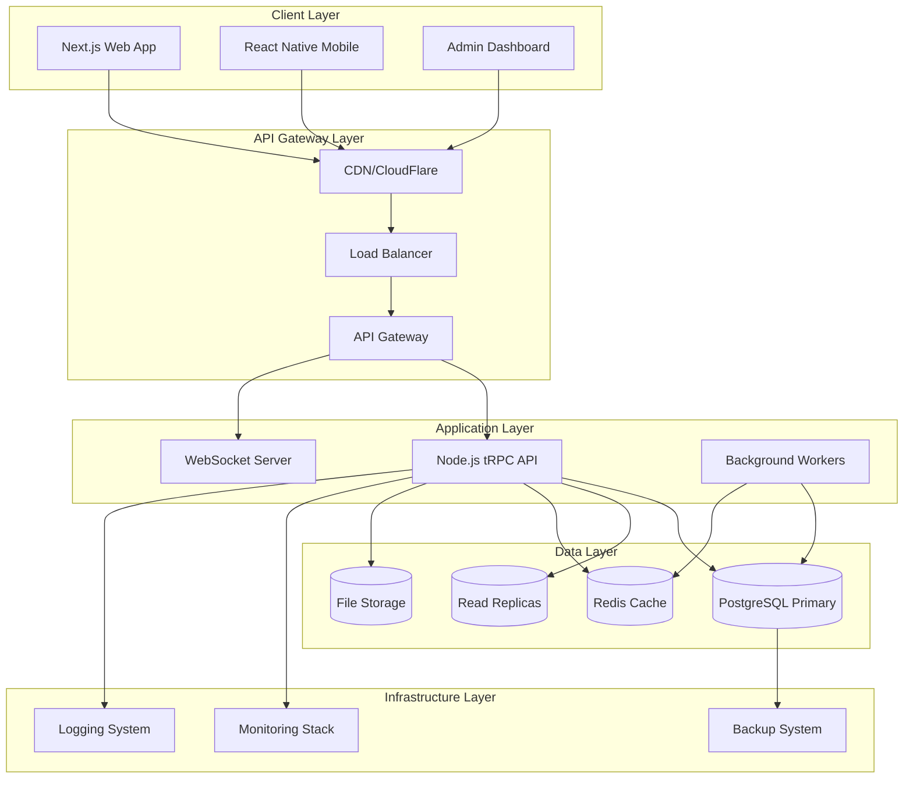
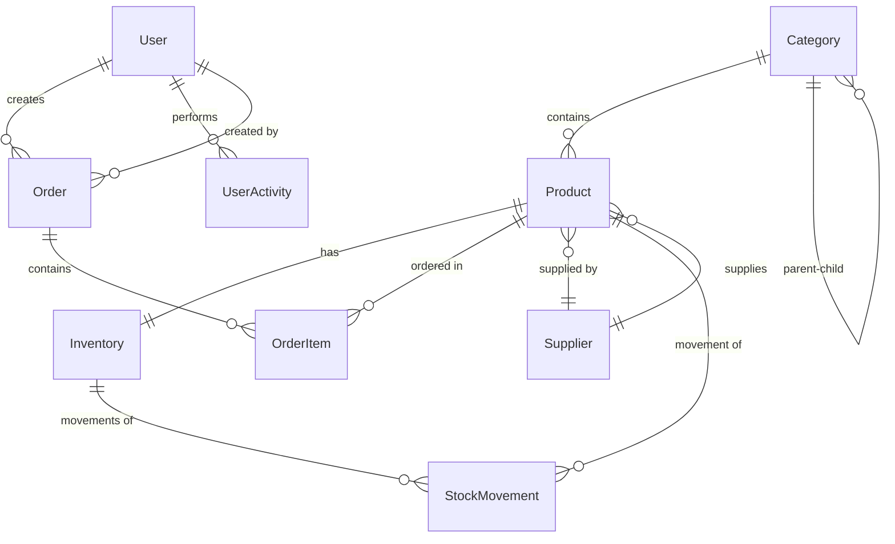

# Full-Stack Monolith Architecture Transformation - Design Document

## Overview

This design document outlines the comprehensive architecture for transforming the existing e-commerce inventory management system into a production-ready, enterprise-grade full-stack monolith. The design emphasizes type safety, scalability, maintainability, and developer experience while preserving all existing business logic and enhancing system capabilities.

The transformation will create a unified ecosystem with modern technologies: Node.js/TypeScript API with tRPC, Next.js 14 web application, React Native mobile apps, shared packages, and comprehensive infrastructure setup. The architecture supports horizontal scaling, real-time features, and enterprise-level monitoring and security.

## Architecture

### High-Level Architecture



### Monorepo Structure

The project will follow a comprehensive monorepo structure optimized for scalability and maintainability:

```
fullstack-ecommerce-monolith/
├── apps/                           # Applications
│   ├── web/                       # Next.js 14 Web Application
│   ├── mobile/                    # React Native Mobile App
│   ├── api/                       # Node.js tRPC API Server
│   └── admin/                     # Admin Dashboard (Optional)
├── packages/                      # Shared Packages
│   ├── shared/                    # Shared types and utilities
│   ├── ui/                        # UI Component Library
│   ├── api-client/                # API Client Library
│   ├── database/                  # Database Layer
│   ├── cache/                     # Cache Layer
│   ├── config/                    # Configuration Management
│   └── validation/                # Validation Schemas
├── infrastructure/                # Infrastructure as Code
│   ├── docker/                    # Docker configurations
│   ├── kubernetes/                # K8s manifests
│   ├── terraform/                 # Infrastructure provisioning
│   └── monitoring/                # Monitoring configurations
├── tools/                         # Development tools
├── docs/                          # Documentation
└── scripts/                       # Build and deployment scripts
```

## Components and Interfaces

### 1. Backend API Architecture

#### tRPC Router Structure

```typescript
// apps/api/src/trpc/routers/index.ts
export const appRouter = router({
  auth: authRouter,
  users: userRouter,
  products: productRouter,
  inventory: inventoryRouter,
  orders: orderRouter,
  suppliers: supplierRouter,
  categories: categoryRouter,
  analytics: analyticsRouter,
  files: fileRouter,
  notifications: notificationRouter,
});

export type AppRouter = typeof appRouter;
```

#### Service Layer Architecture

```typescript
// Service interface pattern
interface BaseService<T, CreateDTO, UpdateDTO> {
  findAll(pagination: PaginationOptions): Promise<PagedResult<T>>;
  findById(id: string): Promise<T>;
  create(data: CreateDTO): Promise<T>;
  update(id: string, data: UpdateDTO): Promise<T>;
  delete(id: string): Promise<void>;
}

// Business service implementation
class ProductService
  implements BaseService<Product, ProductCreateDTO, ProductUpdateDTO>
{
  constructor(
    private productRepository: ProductRepository,
    private inventoryService: InventoryService,
    private eventPublisher: EventPublisher,
    private cacheService: CacheService
  ) {}

  // Implementation with business logic, caching, and event publishing
}
```

#### Database Layer Design

```typescript
// Dual ORM approach for flexibility
interface DatabaseLayer {
  // Drizzle ORM for type-safe operations
  orm: DrizzleDB;
  // Kysely for complex queries
  queryBuilder: Kysely<DatabaseSchema>;
  // Transaction management
  transaction<T>(fn: (tx: Transaction) => Promise<T>): Promise<T>;
}

// Repository pattern with both ORM and query builder
class ProductRepository {
  constructor(private db: DatabaseLayer) {}

  // Simple operations use ORM
  async findById(id: string): Promise<Product | null> {
    return await this.db.orm.select().from(products).where(eq(products.id, id));
  }

  // Complex operations use query builder
  async getProductAnalytics(
    filters: AnalyticsFilters
  ): Promise<ProductAnalytics[]> {
    return await this.db.queryBuilder
      .selectFrom("products")
      .leftJoin("inventory", "products.id", "inventory.product_id")
      .select([
        /* complex aggregations */
      ])
      .where(/* complex conditions */)
      .execute();
  }
}
```

### 2. Frontend Web Application Architecture

#### Next.js 14 App Router Structure

```typescript
// apps/web/src/app/layout.tsx - Root layout with providers
export default function RootLayout({
  children,
}: {
  children: React.ReactNode;
}) {
  return (
    <html lang="en">
      <body>
        <TRPCProvider>
          <AuthProvider>
            <ThemeProvider>
              <ToastProvider>{children}</ToastProvider>
            </ThemeProvider>
          </AuthProvider>
        </TRPCProvider>
      </body>
    </html>
  );
}

// Route groups for organization
// app/(auth)/login/page.tsx - Authentication routes
// app/(dashboard)/inventory/page.tsx - Main application routes
// app/api/trpc/[trpc]/route.ts - tRPC API route
```

#### State Management Architecture

```typescript
// Zustand stores for client state
interface AuthStore {
  user: User | null;
  token: string | null;
  login: (credentials: LoginCredentials) => Promise<void>;
  logout: () => void;
  refreshToken: () => Promise<void>;
}

interface InventoryStore {
  products: Product[];
  filters: ProductFilters;
  pagination: PaginationState;
  setFilters: (filters: ProductFilters) => void;
  loadProducts: () => Promise<void>;
}

// tRPC for server state
const ProductList = () => {
  const {
    data: products,
    isLoading,
    error,
  } = api.products.getAll.useQuery({
    page: 1,
    limit: 20,
    filters: { category: "electronics" },
  });

  const createProduct = api.products.create.useMutation({
    onSuccess: () => {
      // Invalidate and refetch
      utils.products.getAll.invalidate();
    },
  });

  return <div>{/* Product list UI */}</div>;
};
```

### 3. Mobile Application Architecture

#### React Native Structure

```typescript
// apps/mobile/src/navigation/AppNavigator.tsx
const AppNavigator = () => {
  const { user } = useAuth();

  return (
    <NavigationContainer>
      {user ? <MainTabNavigator /> : <AuthStackNavigator />}
    </NavigationContainer>
  );
};

// Screen component with tRPC
const InventoryScreen = () => {
  const { data: inventory, isLoading } = api.inventory.getAll.useQuery();
  const [refreshing, setRefreshing] = useState(false);

  const onRefresh = useCallback(async () => {
    setRefreshing(true);
    await utils.inventory.getAll.invalidate();
    setRefreshing(false);
  }, []);

  return (
    <FlatList
      data={inventory}
      renderItem={({ item }) => <InventoryCard item={item} />}
      refreshControl={
        <RefreshControl refreshing={refreshing} onRefresh={onRefresh} />
      }
    />
  );
};
```

### 4. Shared Package Architecture

#### Type-Safe API Client

```typescript
// packages/api-client/src/index.ts
export class ApiClient {
  private trpc: ReturnType<typeof createTRPCProxyClient<AppRouter>>;

  constructor(config: ApiClientConfig) {
    this.trpc = createTRPCProxyClient<AppRouter>({
      links: [
        httpBatchLink({
          url: config.apiUrl,
          headers: () => this.getAuthHeaders(),
        }),
      ],
    });
  }

  // Expose typed methods
  get products() {
    return this.trpc.products;
  }
  get inventory() {
    return this.trpc.inventory;
  }
  get orders() {
    return this.trpc.orders;
  }
  // ... other routers
}
```

#### Shared Validation Schemas

```typescript
// packages/validation/src/schemas/product.ts
export const ProductCreateSchema = z.object({
  name: z.string().min(1).max(255),
  description: z.string().optional(),
  price: z.number().positive(),
  sku: z.string().regex(/^[A-Z0-9-]+$/),
  categoryId: z.string().uuid(),
  supplierId: z.string().uuid(),
});

export type ProductCreateDTO = z.infer<typeof ProductCreateSchema>;

// Usage in API
const createProduct = publicProcedure
  .input(ProductCreateSchema)
  .mutation(async ({ input, ctx }) => {
    return await ctx.productService.create(input);
  });

// Usage in frontend
const form = useForm<ProductCreateDTO>({
  resolver: zodResolver(ProductCreateSchema),
});
```

### 5. Database Design

#### Schema Migration Strategy

```sql
-- Migration from existing Spring Boot schema to new structure
-- V001__Initial_Schema.sql (converted from existing Flyway migrations)
CREATE TABLE users (
  id UUID PRIMARY KEY DEFAULT gen_random_uuid(),
  email VARCHAR(255) UNIQUE NOT NULL,
  password_hash VARCHAR(255) NOT NULL,
  first_name VARCHAR(100) NOT NULL,
  last_name VARCHAR(100) NOT NULL,
  role VARCHAR(50) NOT NULL DEFAULT 'USER',
  created_at TIMESTAMP WITH TIME ZONE DEFAULT NOW(),
  updated_at TIMESTAMP WITH TIME ZONE DEFAULT NOW()
);

-- V002__Add_Products_And_Categories.sql
CREATE TABLE categories (
  id UUID PRIMARY KEY DEFAULT gen_random_uuid(),
  name VARCHAR(255) NOT NULL,
  description TEXT,
  slug VARCHAR(255) UNIQUE NOT NULL,
  parent_id UUID REFERENCES categories(id),
  created_at TIMESTAMP WITH TIME ZONE DEFAULT NOW(),
  updated_at TIMESTAMP WITH TIME ZONE DEFAULT NOW()
);

CREATE TABLE products (
  id UUID PRIMARY KEY DEFAULT gen_random_uuid(),
  name VARCHAR(255) NOT NULL,
  description TEXT,
  sku VARCHAR(100) UNIQUE NOT NULL,
  price DECIMAL(10,2) NOT NULL,
  category_id UUID NOT NULL REFERENCES categories(id),
  supplier_id UUID NOT NULL REFERENCES suppliers(id),
  created_at TIMESTAMP WITH TIME ZONE DEFAULT NOW(),
  updated_at TIMESTAMP WITH TIME ZONE DEFAULT NOW()
);

-- Indexes for performance
CREATE INDEX idx_products_category_id ON products(category_id);
CREATE INDEX idx_products_supplier_id ON products(supplier_id);
CREATE INDEX idx_products_sku ON products(sku);
```

#### Drizzle Schema Definition

```typescript
// packages/database/src/schema/products.ts
export const products = pgTable("products", {
  id: uuid("id").primaryKey().defaultRandom(),
  name: varchar("name", { length: 255 }).notNull(),
  description: text("description"),
  sku: varchar("sku", { length: 100 }).notNull().unique(),
  price: decimal("price", { precision: 10, scale: 2 }).notNull(),
  categoryId: uuid("category_id")
    .notNull()
    .references(() => categories.id),
  supplierId: uuid("supplier_id")
    .notNull()
    .references(() => suppliers.id),
  createdAt: timestamp("created_at", { withTimezone: true }).defaultNow(),
  updatedAt: timestamp("updated_at", { withTimezone: true }).defaultNow(),
});

export type Product = InferSelectModel<typeof products>;
export type NewProduct = InferInsertModel<typeof products>;
```

## Data Models

### Core Entity Relationships



### TypeScript Type Definitions

```typescript
// packages/shared/src/types/entities.ts
export interface User {
  id: string;
  email: string;
  firstName: string;
  lastName: string;
  role: UserRole;
  createdAt: Date;
  updatedAt: Date;
}

export interface Product {
  id: string;
  name: string;
  description?: string;
  sku: string;
  price: number;
  categoryId: string;
  supplierId: string;
  category?: Category;
  supplier?: Supplier;
  inventory?: Inventory;
  createdAt: Date;
  updatedAt: Date;
}

export interface Order {
  id: string;
  orderNumber: string;
  userId: string;
  status: OrderStatus;
  totalAmount: number;
  items: OrderItem[];
  user?: User;
  createdAt: Date;
  updatedAt: Date;
}

// API Response types
export interface ApiResponse<T> {
  success: boolean;
  data?: T;
  error?: string;
  message?: string;
}

export interface PagedResponse<T> {
  data: T[];
  pagination: {
    page: number;
    limit: number;
    total: number;
    totalPages: number;
  };
}
```

## Error Handling

### Comprehensive Error Management

```typescript
// packages/shared/src/errors/index.ts
export class AppError extends Error {
  constructor(
    public message: string,
    public statusCode: number = 500,
    public code: string = "INTERNAL_ERROR",
    public details?: any
  ) {
    super(message);
    this.name = this.constructor.name;
  }
}

export class ValidationError extends AppError {
  constructor(message: string, details?: any) {
    super(message, 400, "VALIDATION_ERROR", details);
  }
}

export class NotFoundError extends AppError {
  constructor(resource: string, id?: string) {
    super(
      `${resource}${id ? ` with id ${id}` : ""} not found`,
      404,
      "NOT_FOUND"
    );
  }
}

// tRPC error handling
export const errorHandler = (error: any) => {
  if (error instanceof AppError) {
    throw new TRPCError({
      code:
        error.statusCode === 400
          ? "BAD_REQUEST"
          : error.statusCode === 404
          ? "NOT_FOUND"
          : "INTERNAL_SERVER_ERROR",
      message: error.message,
      cause: error.details,
    });
  }

  // Log unexpected errors
  logger.error("Unexpected error:", error);
  throw new TRPCError({
    code: "INTERNAL_SERVER_ERROR",
    message: "An unexpected error occurred",
  });
};

// Frontend error handling
export const useErrorHandler = () => {
  const toast = useToast();

  return useCallback(
    (error: any) => {
      if (error?.data?.code === "VALIDATION_ERROR") {
        toast.error("Please check your input and try again");
      } else if (error?.data?.code === "NOT_FOUND") {
        toast.error("The requested resource was not found");
      } else {
        toast.error("An unexpected error occurred");
      }
    },
    [toast]
  );
};
```

## Testing Strategy

### Multi-Level Testing Approach

```typescript
// Unit Tests
// packages/database/src/__tests__/product-repository.test.ts
describe("ProductRepository", () => {
  let repository: ProductRepository;
  let mockDb: MockDatabase;

  beforeEach(() => {
    mockDb = createMockDatabase();
    repository = new ProductRepository(mockDb);
  });

  it("should create a product successfully", async () => {
    const productData = createMockProduct();
    const result = await repository.create(productData);

    expect(result).toMatchObject(productData);
    expect(mockDb.insert).toHaveBeenCalledWith(products).values(productData);
  });
});

// Integration Tests
// apps/api/src/__tests__/integration/products.test.ts
describe("Products API Integration", () => {
  let testDb: TestDatabase;
  let apiClient: TestApiClient;

  beforeAll(async () => {
    testDb = await createTestDatabase();
    apiClient = createTestApiClient();
  });

  it("should create and retrieve a product", async () => {
    const productData = createTestProduct();

    const created = await apiClient.products.create.mutate(productData);
    expect(created.id).toBeDefined();

    const retrieved = await apiClient.products.getById.query({
      id: created.id,
    });
    expect(retrieved).toMatchObject(productData);
  });
});

// E2E Tests
// tests/e2e/inventory-management.spec.ts
describe("Inventory Management E2E", () => {
  test("should manage product lifecycle", async ({ page }) => {
    await page.goto("/login");
    await page.fill("[data-testid=email]", "admin@test.com");
    await page.fill("[data-testid=password]", "password");
    await page.click("[data-testid=login-button]");

    // Navigate to products
    await page.click("[data-testid=products-nav]");

    // Create product
    await page.click("[data-testid=create-product]");
    await page.fill("[data-testid=product-name]", "Test Product");
    await page.fill("[data-testid=product-sku]", "TEST-001");
    await page.fill("[data-testid=product-price]", "99.99");
    await page.click("[data-testid=save-product]");

    // Verify product appears in list
    await expect(page.locator("[data-testid=product-list]")).toContainText(
      "Test Product"
    );
  });
});
```

### Performance Testing

```typescript
// Performance benchmarks
// tools/performance/api-benchmarks.ts
import { performance } from "perf_hooks";

describe("API Performance Benchmarks", () => {
  it("should handle 1000 concurrent product queries under 100ms", async () => {
    const promises = Array.from({ length: 1000 }, () =>
      apiClient.products.getAll.query({ limit: 10 })
    );

    const start = performance.now();
    await Promise.all(promises);
    const end = performance.now();

    expect(end - start).toBeLessThan(100);
  });
});
```

This design provides a comprehensive foundation for the full-stack monolith transformation, ensuring type safety, scalability, maintainability, and excellent developer experience while preserving all existing business logic and enhancing system capabilities.
